The network needs to satisfy the following(Kubernetes) requirements:
1. All containers can communicate with all other containers without NAT
2. All nodes can communicate with all containers ( and vice-versa) without NAT
3. The IP that a container sees itself as is the same IP that others see it as


## Container


## Network
Routers have an IP and MAC for each network they are connected to
Routers have routing tables- a map of every network

- Physical (e.g. cable, RJ45)
- Data Link (e.g. MAC, switches)
- Network (e.g. IP, routers)
- Transport (e.g. TCP, UDP, port numbers)
- Session (e.g. Syn/Ack)
- Presentation (e.g. encryption, ASCII, PNG, MIDI)
- Application (e.g. SNMP, HTTP, FTP)


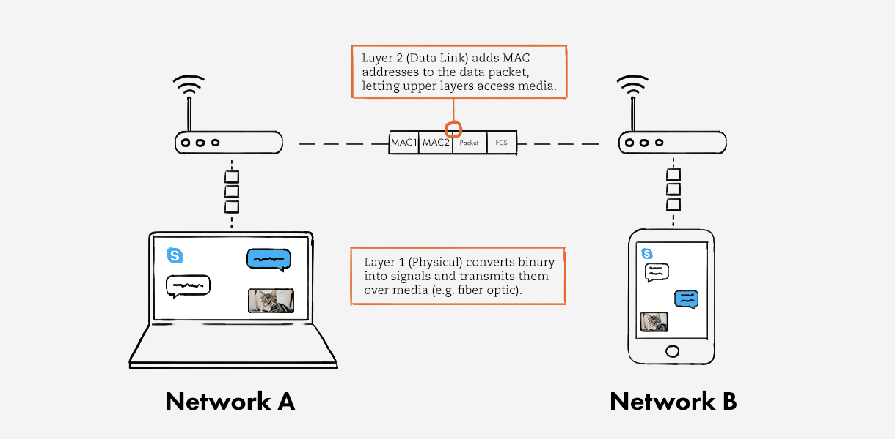
This layer converts the binary from the upper layers into signals and transmits them over local media. These can be electrical, light, or radio signals; it depends on the type of media used.

Layer 2 (Data Link) receives packets from Layer 3. Whereas Layer 4 performs logical addressing (IPv4, IPv6), Layer 2 performs physical addressing. It adds sender and receiver MAC addresses to the data packet to form a data unit called a frame. Layer 2 enables frames to be transported via local media (e.g. copper wire, optical fiber, or air).

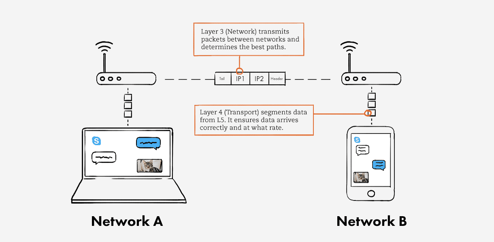

Layer 3 (Network) transmits data segments between networks in the form of packets. When you message your friend, this layer assigns source and destination IP addresses to the data segments. Your IP address is the source, and your friend’s is the destination. Layer 3 also determines the best paths for data delivery

Layer 4 (Transport) receives data from Layer 5 and segments it. Each segment, or data unit, has a source and destination port number, as well as a sequence number. The port number ensures that the segment reaches the correct application. The sequence number ensures that the segments arrive in the correct order.

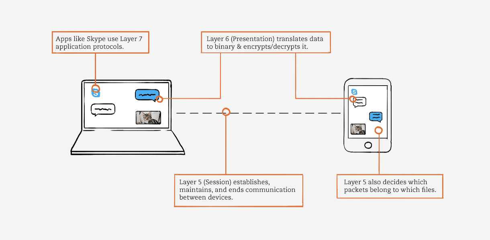


7. Application layer: Data generated by and usable by software applications. The main protocol used at this layer is HTTP.
This layer provides the protocols that allow software/apps to transmit data, including:

HTTP and HTTPS
FTP
POP & SMTP
DNS
Telnet
DHCP
SNMP

6. Presentation layer: Data is translated into a form the application can accept. Some authorities consider HTTPS encryption and decryption to take place at this layer.
5. Session layer: Controls connections between computers (this can also be handled at layer 4 by the TCP protocol).
4. Transport layer: Provides the means for transmitting data between the two connected parties, as well as controlling the quality of service. The main protocols used here are TCP and UDP.
3. Network layer: Handles the routing and sending of data between different networks. The most important protocols at this layer are IP and ICMP.
2. Data link layer: Handles communications between devices on the same network. If layer 3 is like the address on a piece of mail, then layer 2 is like indicating the office number or apartment number at that address. Ethernet is the protocol most used here.
1. Physical layer: Packets are converted into electrical, radio, or optical pulses and transmitted as bits (the smallest possible units of information) over wires, radio waves, or cables.

[osi](https://www.radware.com/cyberpedia/application-security/the-osi-model-breaking-down-its-seven-layers/)


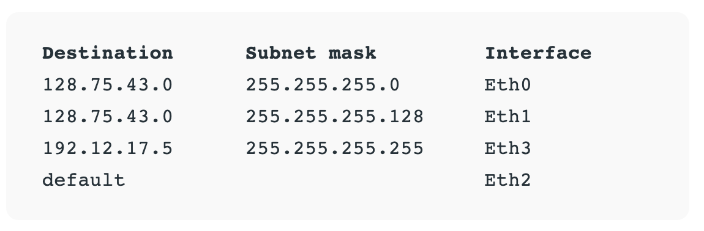

The entry corresponding to the default gateway configuration is a network destination of 0.0.0.0 with a network mask (netmask) of 0.0.0.0. The Subnet Mask of default route is always 0.0.0.0 

Each entry in the routing table consists of the following entries:

- Network ID:
The network ID or destination corresponding to the route.
- Subnet Mask:
The mask that is used to match a destination IP address to the network ID.
- Next Hop:
The IP address to which the packet is forwarded
- Outgoing Interface:
Outgoing interface the packet should go out to reach the destination network.
- Metric:
A common use of the metric is to indicate the minimum number of hops (routers crossed) to the network ID.

[routing table](https://www.baeldung.com/cs/routing-table-entry)

`netstat -rn`  to list routing table on mac


When routers receive IP packets that need to be forwarded somewhere else in the network, the router looks at the packet's destination IP address and then searches for the routing information in the routing table.

Upon receiving a data packet, the router identifies the destination IP address from its header and consults its routing table—a comprehensive list of paths to various network destinations—to determine the most efficient route for data transfer

Longest Prefix Match is a best path selection mechanism used by routers. This mechanism basically compares the destination IP address and the routing table entry to determine the best available route alternative. So how it does this mechanism work?
When router receives a packet, it compares the destination IP address bit by bit with the entries in the routing table. The entry that has the longest number of network bits which matches the destination IP address, is selected as the best path

Below, you can find an example of a Longest Prefix Match. Here, the network bits that matches more with the destination, will be the best path.
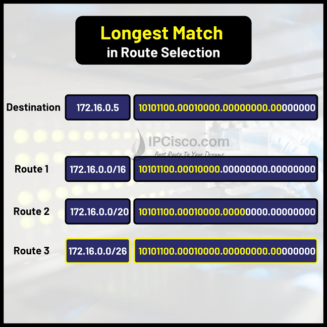

For this example, Route 3 is the best path.

A primary function of a router is to forward packets toward their destination. This is accomplished by using a switching function, which is the process used by a router to accept a packet on one interface and forward it out another interface. A key responsibility of the switching function is to encapsulate packets in the appropriate data link frame type for the outgoing data link.

What does a router do with a packet received from one network and destined for another network?


The router performs the following three major steps:

Step 1. De-encapsulates the Layer 2 frame header and trailer to expose the Layer 3 packet.

Step 2. Examines the destination IP address of the IP packet to find the best path in the routing table.

Step 3. If the router finds a path to the destination, it encapsulates the Layer 3 packet into a new Layer 2 frame and forwards the frame out the exit interface.
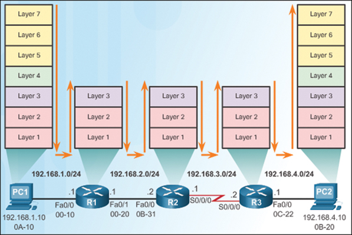

As shown above, devices have Layer 3 IPv4 addresses, and Ethernet interfaces have Layer 2 data link addresses. For example, PC1 is configured with IPv4 address 192.168.1.10 and an example MAC address of 0A-10. As a packet travels from the source device to the final destination device, the Layer 3 IP addresses do not change. However, the Layer 2 data link addresses change at every hop as the packet is de-encapsulated and re-encapsulated in a new Layer 2 frame by each router.

It is common for packets to require encapsulation into a different type of Layer 2 frame than the one in which it was received. For example, a router might receive an Ethernet encapsulated frame on a FastEthernet interface and then process that frame to be forwarded out of a serial interface.

Notice above that the ports between R2 and R3 do not have associated MAC addresses. This is because it is a serial link. MAC addresses are only required on Ethernet multiaccess networks. A serial link is a point-to-point connection and uses a different Layer 2 frame that does not require the use of a MAC address. In this example, when Ethernet frames are received on R2 from the Fa0/0 interface, destined for PC2, they are de-encapsulated and then re-encapsulated for the serial interface, such as a PPP encapsulated frame. When R3 receives the PPP frame, it is de-encapsulated again and then re-encapsulated into an Ethernet frame with a destination MAC address of 0B-20, prior to being forwarded out the Fa0/0 interface.

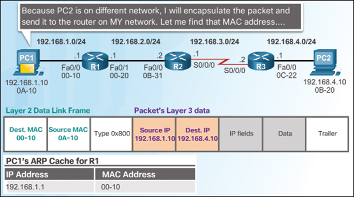

Above, PC1 is sending a packet to PC2. PC1 must determine if the destination IPv4 address is on the same network. PC1 determines its own subnet by doing an AND operation on its own IPv4 address and subnet mask. This produces the network address that PC1 belongs to. Next, PC1 does this same AND operation using the packet destination IPv4 address and the PC1 subnet mask.

If the destination network address is the same network as PC1, then PC1 does not use the default gateway. Instead, PC1 refers to its Address Resolution Protocol (ARP) cache for the MAC address of the device with that destination IPv4 address. If the MAC address is not in the cache, then PC1 generates an ARP request to acquire the address to complete the packet and send it to the destination. If the destination network address is on a different network, then PC1 forwards the packet to its default gateway.

To determine the MAC address of the default gateway, PC1 checks its ARP table for the IPv4 address of the default gateway and its associated MAC address.

use `arp -a` to view list on mac

If an ARP entry does not exist in the ARP table for the default gateway, PC1 sends an ARP request. Router R1 sends back an ARP reply. PC1 can then forward the packet to the MAC address of the default gateway, the Fa0/0 interface of router R1.

A similar process is used for IPv6 packets. However, instead of the ARP process, IPv6 address resolution uses ICMPv6 Neighbor Solicitation and Neighbor Advertisement messages. IPv6-to-MAC address mappings are kept in a table similar to the ARP cache, called the neighbor cache.

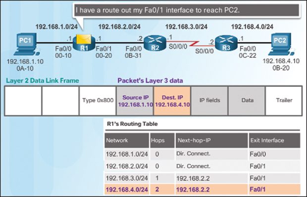
shows the processes that take place when R1 receives the Ethernet frame from PC1.


All addresses on one network belong to the same prefix
• Node uses a table that lists the next hop for prefixes


Longest matching prefix forwarding rule:
– For each packet, find the longest prefix that contains the
destination address, i.e., the most specific entry
– Forward the packet to the next hop router for that prefix
ingress- traffic arrives,going in


When a router receives a packet, the router checks its routing table to determine if the destination address is for a system on one of it's attached networks or if the message must be forwarded through another router. It then sends the message to the next system in the path to the destination.


Exit Interface
Remember router works by ‘receiving’ a packet from one interface and ‘forward’ this packet out to another interface. The interface that the packets are being forward out to; is called the Exit Interface. This is normally tagged as the interface names; for example, e0/0, fa0/0 or g0/0 depending on the interface types.

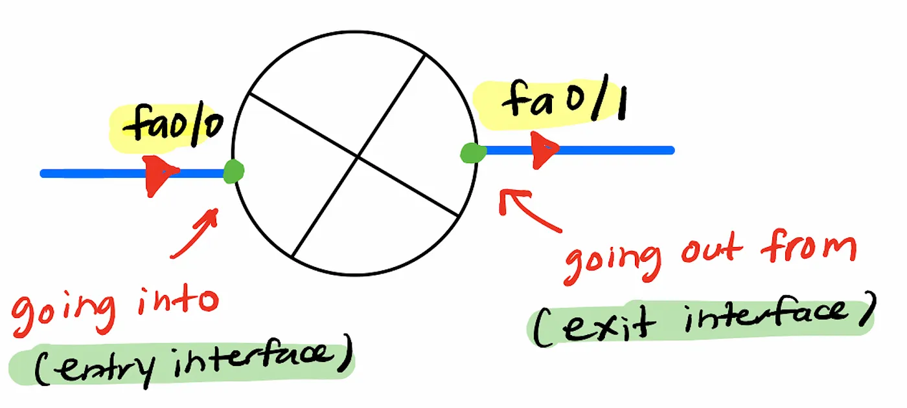

In our example, PC0 sends a packet to PC2. When the packet arrived at Router0 from fa0/0; it will checks the exit interface that leads to LAN2. In this case, the exit interface is fa0/1. Router0 then forward the packets out from itself via fa0/1 interface
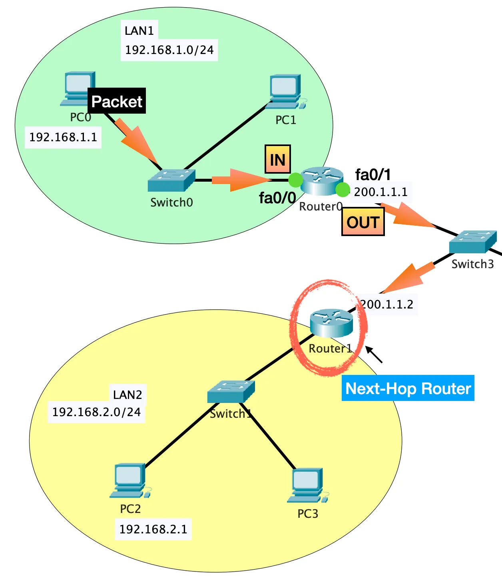


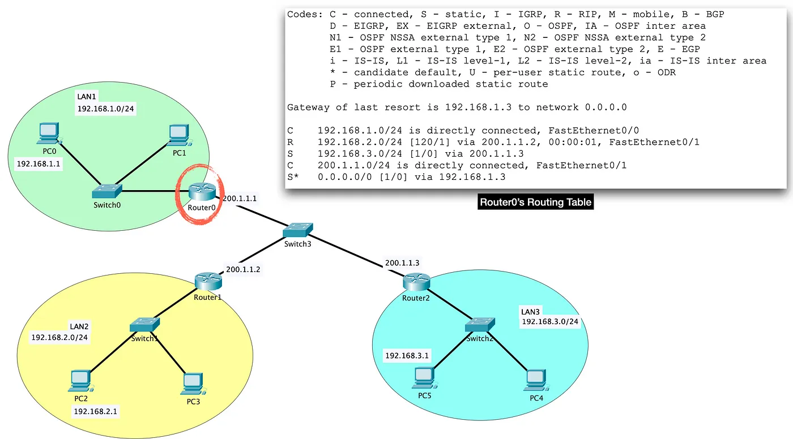

what does Router0 table tells us.

First, we know that Router0 can go to 4 different networks (there are 4 destination networks)

Second, we know that two of these networks are directly connected (there are 2 ‘C’ in the table); which means only two routes are configured.

Third, we know that LAN1 can go to LAN3 through Router0 using a static route to the next hop router Router3 with the IP 200.1.1.3 (the route is tagged as ‘S’). This means, even if we configure dynamic route from LAN1 →LAN3; the static route will still be used.

Fourth, we know that LAN1 can go to LAN2 through Router0 using a RIPv1 route and the next hop router is Router1 with the IP 200.1.1.2 (this route is tagged as ‘R’)

Fifth, we know that there is a default route configured on Router0 pointing to Router3 (tagged as ‘S*’ in the table). Default route means the last resort of routing; which is the path a packet should travel if the router does not know where to forward it to. This means that Router0 will forwards any packets having destination network that is not in its router table to Router3.


Ethernet is a protocol that uses cables to connect various networking devices. TCP/IP is used to create computer networks that rely on wireless connections. We make use of fiber channels to move large amounts of data between computer systems

The physical layer plays a vital role in controlling the transmission rate. Whenever some device sends data to the physical layer, it receives the data, converts the data to bits, and sends the data link layer. While transferring the bits, it defines the number of bits transmitted per second.

The data link layer is responsible for the data transfer between two directly connected nodes.When the physical layer receives data, it converts it to bits and sends it to the data link layer. The data link layer ensures the data or packet received from the physical layer is error-free and then transfers the data from one node to another. It sends the packet to another node using its MAC address.

The data link layer is further divided into two sub-layers: Logical Link Control (LLC) and Media Access Control (MAC). The LLC layer is responsible for checking the errors in the received packet, and it synchronizes the frames. The MAC layer controls the access of networking devices to the transmission medium. It also gives permission to transfer the data from one node to another.

As soon as the raw data from the physical layer reaches the data link layer, it converts the raw data into packets, called frames. With a frame, it also adds a header and trailer. A header and trailer include information for hardware destination and source address. In this way, it also helps the packet to reach the destination:


The primary responsibility of the data link layer is to control the flow of the data. Suppose some data is transferred from one high processing server to another low processing server. The data link layer makes sure the data rate matches between two servers and no data get corrupted.


Routers use a routing table to forward traffic from one network to another. The routing table stores the destination addresses for networks, hosts, or subnets accessible through a router.


The routing table contains the address of the next hop of each connected network. The next hop of a network is the router through which a packet must go to reach the destination network. Once a router receives an incoming packet, it uses the routing table to find the next hop.

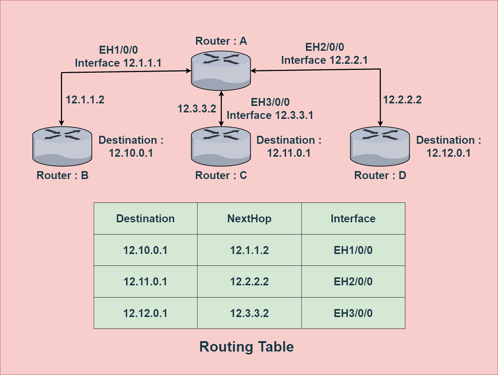

The router table contains the destination address, next hop address, and interface information. Here, in this sample network, we have four routers. The example presents the routing table corresponding to Router A. As we can see, from Router A, we can reach three other routers. Hence, the routing table of Router A contains three entries.

Routing tables help in the communication of the routers. When routers connect to each other, a routing table is created for each of the connected routers. A routing table stores the destination IP address of each network that can be reached through that router.

One of the important applications of a routing table is to prevent loops in a network. When a router receives a packet, it forwards the packet to the next hop following its routing table. A routing loop may occur if the next hop isn’t defined in the routing table. In order to prevent such loops, we use a routing table to stop forwarding packets to networks that can’t be reached through that router.

Additionally, a routing table helps find the next hop for a packet. Once a router receives an incoming packet, it utilizes the routing table to find the next hop of the packet.

For a host to send data to another host, it starts by adding a layer 3 header, which includes a source and destination ip
. A new layer 2 header is added to facilitate each hop along the path between the two endpoints

Routing table can be populated via three methods:
1. Directly connected- Routes for the networks which are attached
2. Static Routes-Routes manualyy provided by an administrator
3. Dynamic Routes- Routes learned automatically from other routers


## Subnet
172.16.0.0/16
usable host ip range: 172.16.0.1-172.255.254
Broadcast address 172.16.255.255
total number of hosts: 65536
class B
number of usable hosts: 65534

172.16.0.0/15

networkaddress :172.16.0.0

usable host ip range : 172.16.0.1 -172.17.255.254
 class A
broadcast address : 172.17.255.255

total number of usable hosts : 131070

subnet mask : 255.254.0.0

There are 128 possible /15 networks for 127.*.*.*
172.16.0.0/17

network address : 172.16.0.0
usable host ip range : 172.16.0.1-172.16.127.254
class B
broadcast address : 172.16.127.255
total number of hosts: 32768
subnet mask : 255.255.128.0

there are 2 possible /17 networks for 127.16.*.*

```bash
Network Address	  Usable Host Range	                     Broadcast Address:
172.16.0.0	    172.16.0.1 - 172.16.127.254	              172.16.127.255
172.16.128.0	172.16.128.1 - 172.16.255.254	          172.16.255.255
```


172.16.0.0/18

network address : 172.16.0.0
Usable host ip range : 172.16.0.1-172.16.63.254

broadcast address : 172.16.63.255
class B
total number of hosts :16384
total number of usable hosts 16282
subnet mask : 255.255.192.0

All 4 possible /18 networks for 172.16.*.*

```bash
Network Address	   Usable Host Range	              Broadcast Address:
172.16.0.0	      172.16.0.1 - 172.16.63.254	      172.16.63.255
172.16.64.0	      172.16.64.1 - 172.16.127.254	      172.16.127.255
172.16.128.0	  172.16.128.1 - 172.16.191.254	      172.16.191.255
172.16.192.0	  172.16.192.1 - 172.16.255.254	      172.16.255.255

```

Route Table for /18 above

```bash
Destination	    Subnet Mask	   Gateway	   Interface	Description
172.16.0.0/18	255.255.192.0	0.0.0.0	   eth0          Local traffic within Subnet 1
172.16.64.0/18	255.255.192.0	0.0.0.0	   eth1	         Local traffic within Subnet 2
172.16.128.0/18	255.255.192.0	0.0.0.0	   eth2	         Local traffic within Subnet 3
172.16.192.0/18	255.255.192.0	0.0.0.0	   eth3	        Local traffic within Subnet 4
0.0.0.0/0	0.0.0.0	172.16.x.1	eth[0-3]	Default route (Internet access, replace x with specific gateway for each subnet)
```

```bash
Assign IP Addresses to Router Interfaces
Each router should have at least one interface assigned an IP address within the subnet it manages. This IP typically acts as the default gateway for the devices in that subnet.

Example Configuration for Four Routers:

Router1 for 172.16.0.0/18:
Interface: eth0
IP Address: 172.16.0.1/18
Router2 for 172.16.64.0/18:
Interface: eth0
IP Address: 172.16.64.1/18
Router3 for 172.16.128.0/18:
Interface: eth0
IP Address: 172.16.128.1/18
Router4 for 172.16.192.0/18:
Interface: eth0
IP Address: 172.16.192.1/18

 4  /18 subnet within a larger /16 network

 When the router receives a packet destined for 172.16.0.4, it:

Compares the destination IP address against the routing table entries to find a matching route.
The subnet mask 255.255.192.0 (/18) will be applied to both the IP address in the table (172.16.0.0) and the destination IP address (172.16.0.4) to determine if they fall within the same network. This is done through a bitwise AND operation:
172.16.0.4 AND 255.255.192.0 = 172.16.0.0
172.16.0.0 AND 255.255.192.0 = 172.16.0.0
Since both results are the same (172.16.0.0), it confirms that 172.16.0.4 is within the network 172.16.0.0/18.

```
172.16.0.0/19

network address : 172.16.0.0

usable host ip range : 172.16.0.1-172.16.31.254

broadcast address : 172.16.31.255
class B
total number of hosts :8192
total number of usable hosts : 8190

subnet mask 255.255.254.0


All 8 possible /19 networks for  172.16.*.* 

```bash
Network Address	   Usable Host Range	          Broadcast Address:
172.16.0.0	      172.16.0.1 - 172.16.31.254	  172.16.31.255
172.16.32.0	      172.16.32.1 - 172.16.63.254	  172.16.63.255
172.16.64.0	      172.16.64.1 - 172.16.95.254	  172.16.95.255
172.16.96.0	      172.16.96.1 - 172.16.127.254	  172.16.127.255
172.16.128.0	  172.16.128.1 - 172.16.159.254	  172.16.159.255
172.16.160.0	  172.16.160.1 - 172.16.191.254	  172.16.191.255
172.16.192.0	  172.16.192.1 - 172.16.223.254	  172.16.223.255
172.16.224.0	  172.16.224.1 - 172.16.255.254	  172.16.255.255

```

172.16.0.0/20
Network address : 172.16.0.0

usable host ip range : 172.16.0.1-172.16.15.254

broadcast address : 172.16.15.255
class B
Total number of hosts 4096

number of usable hosts 4094

subnet mask 255.255.240.0

All 16 possible /20 networks for 172.16.*.*

 ```bash
Network Address	    Usable Host Range	          Broadcast Address:
172.16.0.0	     172.16.0.1 - 172.16.15.254	     172.16.15.255
172.16.16.0	     172.16.16.1 - 172.16.31.254	 172.16.31.255
172.16.32.0	     172.16.32.1 - 172.16.47.254	 172.16.47.255
172.16.48.0	     172.16.48.1 - 172.16.63.254	 172.16.63.255
172.16.64.0	     172.16.64.1 - 172.16.79.254	 172.16.79.255
172.16.80.0	     172.16.80.1 - 172.16.95.254	 172.16.95.255
172.16.96.0	     172.16.96.1 - 172.16.111.254	 172.16.111.255
172.16.112.0	 172.16.112.1 - 172.16.127.254	 172.16.127.255
172.16.128.0	 172.16.128.1 - 172.16.143.254	 172.16.143.255
172.16.144.0	 172.16.144.1 - 172.16.159.254	 172.16.159.255
172.16.160.0	 172.16.160.1 - 172.16.175.254	 172.16.175.255
172.16.176.0	 172.16.176.1 - 172.16.191.254	 172.16.191.255
172.16.192.0	 172.16.192.1 - 172.16.207.254	 172.16.207.255
172.16.208.0	 172.16.208.1 - 172.16.223.254	 172.16.223.255
172.16.224.0	 172.16.224.1 - 172.16.239.254	 172.16.239.255
172.16.240.0	 172.16.240.1 - 172.16.255.254	 172.16.255.255

 ``` 


127.16.0.0/24

network address 172.16.0.0
usable host ip range 172.16.0.1- 172.16.0.254

broadcast address 172.16.0.255
class C
total number of hosts= 256
subnet mask 255.255.255


172.16.0.0/26

network address : 127.16.0.0

usable host ip range 172.16.0.1- 172.16.0.62

broadcast address 172.16.0.63
class C
total number of hosts 64

number of usable hosts 62

subnet mask 255.255.255.192


All 4 possible /26 networks for 172.16.0.* 

Network Address	  Usable Host Range	                Broadcast Address:
172.16.0.0	      172.16.0.1 - 172.16.0.62	        172.16.0.63
172.16.0.64	      172.16.0.65 - 172.16.0.126	    172.16.0.127
172.16.0.128	  172.16.0.129 - 172.16.0.190	    172.16.0.191
172.16.0.192	  172.16.0.193 - 172.16.0.254	    172.16.0.255


172.16.0.0/15, 172.16.0.0/23 and 172.16.0.0/31 all have 128 possible networks because we have stolen 7 host bits

like wise 172.16.0.0/14 , 172.16.0.0/22 and 172.16.0.0/30 all have 64 possible networks
[](https://www.controleng.com/articles/wi-fi-and-the-osi-model/)


Subnets are logical subdivisions of an IP network. This allows us to segment a network into smaller subnets.

For example, a netmask with notation /24 indicates that the first 24 bits of the IP address identify the network, while the remaining 8 bits determine the hosts:

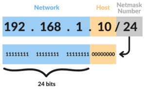


A network ID or NetID is the fragment of IP address that classifies the network for a specified host i.e., it tells us which network the host belongs to,

t is the fragment of an IP address that uniquely classifies a host on a specified TCP/IP network. A host ID can be found simply by ANDing the IP address in binary form with its respective default subnet mask (in binary form)

For Example, In the above Image, the  IP address of host C is 198.162.30.4 which means it belongs to class C, so its default subnet mask will be 255.255.255.0; Now applying AND on both, it will give the host ID 0.0.0.4 and network ID 198.162.30.0.

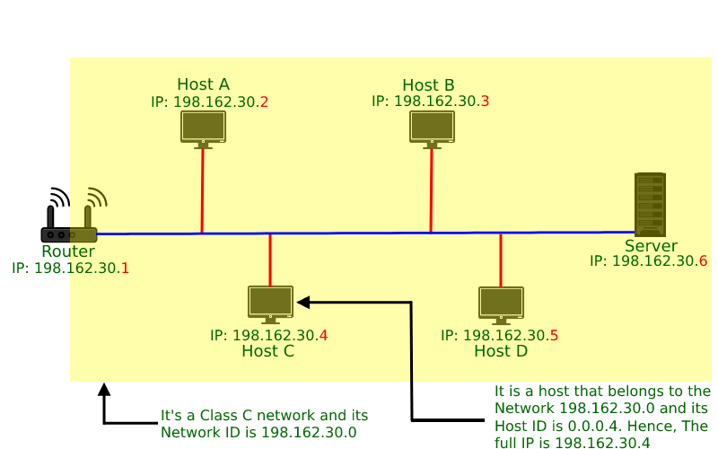


 A company is granted the site address 181.56.0.0. The company needs 1000 subnets. Find the subnet mask 

Solution:  The given address belongs to class B 

and the default subnet mask of class B is, 255.255.0.0

to get 1000 subnets we perform a log operation 

log 1000=10 

So, we require extra 10 bits from 255.255.00000000.00000000 to get the subnet mask i.e.;  255.255.00000000.000000000

So, the required subnet mask is 255.255.11111111.11000000 or 255.255.255.192

The subnet mask determines the boundary between the network ID and the host ID by indicating the number of bits allocated for each.

The subnet mask consists of a series of 1s followed by a series of 0s. The 1s represent the network bits, while the 0s represent the host bits. The length of the series of 1s in the subnet mask indicates the size of the network ID.

The subnet mask helps routers and devices determine whether a destination IP address is within the same network or a different network. When sending data packets, the router applies bitwise logical AND operation between the destination IP address and the subnet mask. This operation retrieves the network ID of the destination address, allowing the router to decide whether the packet can be sent directly or needs to be forwarded to another network

A subnet mask is a 32-bit number that is used to divide an IP address into two parts: the network ID and the host ID.
The subnet mask consists of a series of 1s and 0s. The 1s indicate which bits in the IP address belong to the network ID, while the 0s indicate which bits belong to the host ID. For example, a subnet mask of 255.255.255.0 means that the first three IP address octets belong to the network ID, while the last octet belongs to the host ID.

The number of available IP addresses per network decreases as the subnet mask gets larger (i.e., fewer bits for the host ID). However, the number of available networks increases. Conversely, the number of available IP addresses per network increases as the subnet mask gets smaller (i.e., more bits for the host ID). But the number of available networks decreases.

we perform a bitwise AND operation between the IP address and the subnet mask:
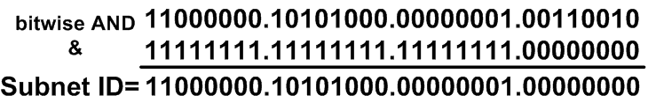

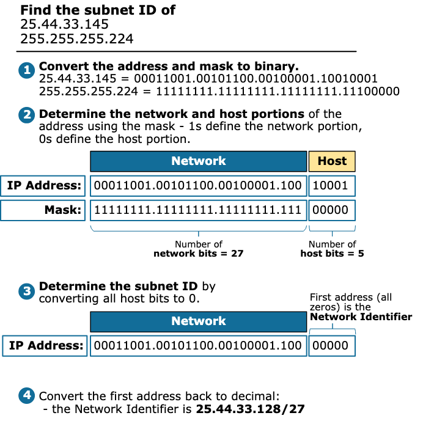


Finding the Subnet ID
Finding the subnet ID is a three steps process:

1. First, we convert the IP address and the Mask to binary.
2. Then we determine the network and host portions of the address based on the mask. 1s define the network portion, and 0s define the host portion of the address.
3. We find the subnet ID in binary by changing all host bits to 0s. We find the Broadcast address in binary by changing all host bits to 1s. 
4. We convert the binary representations to decimals.


Networks in the internet are connected to each other via routers. Routers carry traffic from one network/subnet to another. Routers maintain a routing table to decide how to route the IP packets. Each routing entry consists of the destination address, subnet mask and "route to" field. When a message needs to be routed to an IP address, the following steps are followed:

1. The destination IP address is masked with the subnet mask and then compared with the destination field for all entries in the routing table.
2. This comparison may yield a match with more than one entry the entry with the longest subnet mask will be selected. E.g. , a packet destined for 128.8.1.2 reaching Host A would match the entries corresponding to 128.8.1.2 and 128.8.0. The entry corresponding to 128.8.1.2 will be selected, as it has a longer subnet mask.
3. Once an entry has been selected, the "route to" field is consulted and the action taken depends on the contents of this field:
- If the "route to" field contains SELF the packet is meant for this node. The IP packet is passed to the OS for application processing
- If the "route to" field contains a LAN interface id, the packet is destined for a LAN that is directly connected to the router/host. In this case, the packet is routed directly on the LAN.
- If the "route to" field contains an IP address, the packet is forwarded to the IP address specified. Further routing of the packet will be carried out by the specified IP address.


```bash
#For each router, you assign the first usable IP in the subnet to the router's interface that connects to that subnet.

Router1 (for 172.16.0.0/18):
Interface Configuration:
  ip address 172.16.0.1 255.255.192.0
  no shutdown

Router2 (for 172.16.64.0/18):
Interface Configuration:
  ip address 172.16.64.1 255.255.192.0
  no shutdown

Router3 (for 172.16.128.0/18):
Interface Configuration:
  ip address 172.16.128.1 255.255.192.0
  no shutdown

Router4 (for 172.16.192.0/18):
Interface Configuration:
  ip address 172.16.192.1 255.255.192.0
  no shutdown


#Assuming you're using OSPF as your routing protocol to ensure all routers know about each other's networks:

Router1 Configuration:
  router ospf 1
  network 172.16.0.0 0.0.63.255 area 0

Router2 Configuration:
  router ospf 1
  network 172.16.64.0 0.0.63.255 area 0

Router3 Configuration:
  router ospf 1
  network 172.16.128.0 0.0.63.255 area 0

Router4 Configuration:
  router ospf 1
  network 172.16.192.0 0.0.63.255 area 0

```
## Nginx
`user nginx` means the application processes are runned as the nginx user

[](https://www.digitalocean.com/community/tutorials/how-to-set-up-a-firewall-with-ufw-on-ubuntu)

[](https://www.cloudflare.com/learning/ddos/glossary/open-systems-interconnection-model-osi/)


UFW

is a service, which means it can be enabled, disabled , restarted, started etc


### Postgres

pg_dump-- back up database

pg_restore --uses the file created with pg_dump to restore the database

We create a user that has access to only the database we want to use

Installing postgres creates a user called `postgres`. The `postgres` user has admin access to all database functions

`sudo su postgres` to switch to this user

```bash
CREATE USER linode_user WITH PASSWORD 'linode_password';

CREATE USER ubuntu WITH PASSWORD 'ubuntu_password';

CREATE DATABASE linode_db WITH OWNER linode_user

CREATE DATABASE linode_db WITH OWNER ubuntu

psql -h localhost -U linode_user linode_db

pg_restore -c --if-exists -h localhost -U linode_user -d linode_db linode_backup
```


### User management- Ubuntu
Ubuntu developers made a conscientious decision to disable the administrative root account by default in all Ubuntu installations. This does not mean that the root account has been deleted or that it may not be accessed. It merely has been given a password hash which matches no possible value, therefore may not log in directly by itself.

Instead, users are encouraged to make use of a tool by the name of ‘sudo’ to carry out system administrative duties. Sudo allows an authorized user to temporarily elevate their privileges using their own password instead of having to know the password belonging to the root account. This simple yet effective methodology provides accountability for all user actions, and gives the administrator granular control over which actions a user can perform with said privileges.
To disable the root account password, use the following passwd syntax:

`sudo passwd -l root`

`sudo adduser username`
To delete a user account and its primary group, use the following syntax:

`sudo deluser username`


To add a user to a group, use the following syntax:

`sudo adduser username groupname`


When a new user is created, the adduser utility creates a brand new home directory named /home/username

If your server will be home to multiple users, you should pay close attention to the user home directory permissions to ensure confidentiality. By default, user home directories in Ubuntu are created with world read/execute permissions. This means that all users can browse and access the contents of other users home directories. This may not be suitable for your environment.

To verify your current user home directory permissions, use the following syntax:

`ls -ld /home/username`

The following output shows that the directory /home/username has world-readable permissions:

`drwxr-xr-x  2 username username    4096 2007-10-02 20:03 username`

You can remove the world readable-permissions using the following syntax:

`sudo chmod 0750 /home/username`

A much more efficient approach to the matter would be to modify the adduser global default permissions when creating user home folders. Simply edit the file /etc/adduser.conf and modify the DIR_MODE variable to something appropriate, so that all new home directories will receive the correct permissions.

DIR_MODE=0750


IPv4 address for eth0 : 172.104.227.229
IPv4 address for eth0 : 192.168.158.202
[](https://ubuntu.com/server/docs/user-management)


`useradd -m -s /bin/bash user's name && passwd user's name`
-s is for shell and -m for directory
then make the user admin
`usermod -aG sudo(admin or wheel) user's name`


## SSH
Secure Shell provides several executable commands with additional features:

ssh – for logging into a remote machine and for executing commands on a remote machine
sshd – it’s an SSH server daemon process that waits for incoming SSH connection requests from SSH clients and enables authorized systems to connect to the localhost
ssh-keygen – new authentication key pair for SSH, used to automate logins to implement Single Sign-On and to authenticate hosts
ssh-copy-id – allows to copy, install and configure an SSH key on a server
scp – an SSH-secured version of the RCP protocol that lets us copy files from one machine to another
sftp – an SSH-secured version of the FTP protocol that is used to share files in Internet


then we generate an ssh key
`ssh-keygen`

then to copy the public key, we use
`ssh-copy-id -i ~/.ssh/id_rsa.pub username@ip adress`

 we can then edit `/etc/ssh/sshd_config` file and disable root login
 then add `AllowUsers usernames` to the file 

 `ssh-keygen -t ed25519 -C "comment in here"`

 you can give it a different path from the default `user's home directory/.ssh/keyname`

 to associate a key with a server, we use 
 `ssh-copy-id -i path_to_pulic key  server_to_connect_to`
 this copies the public key to this server

you can also disable root login
`ssh-copy-id username@hostip`
 ssh agent allows us to cache the key
 `eval $(ssh-agent)` to start the agent

 use `ssh-add path_to_public_key` to add to agent

`ls -l .git`
## Creating Key Pair
We can also use SSH to generate the private and public key pair in your machine:

`ssh-keygen -t rsa`

We’ve used ssh-keygen command to create the private-public key pair. The public key is shared with the remote computer, and the private key is kept confidential for security


## What Is an SSH Fingerprint?
An SSH fingerprint is a cryptographic hash value that uniquely identifies an SSH server. In essence, it serves as a digital signature that helps verify the authenticity and integrity of a remote server before establishing an SSH connection.

## How SSH Fingerprints Are Generated
When an SSH server is set up, it generates a pair of cryptographic keys: a public key and a private key. The public key is then used to generate the fingerprint, which is a unique representation of the server’s identity. This fingerprint can be retrieved and compared during the SSH connection process to ensure the server’s authenticity.


Any device capable of communicating over some network has one or more network interfaces. These interfaces are physical components that allow devices to transmit data across a communication channel

A loopback interface, on the other hand, is a virtual network interface that doesn’t have a physical interface associated with it. This interface allows, for example, the device to communicate with itself using the TCP/IP protocol stack.


Generally, due to the Same Origin Policy (SOP), malicious scripts can’t access data from other domains (origins).

The term origin typically refers to the protocol, domain, and port. For example, https://www.baeldung.com and http://www.baeldung.com have different origins because the protocols differ.

CSP is another security measure we implement via an HTTP header.

Without a CSP, the browser loads every file on a website, which may be risky. By specifying the proper CSP directive in the HTTP response header, CSP restricts which data sources a web application can use:

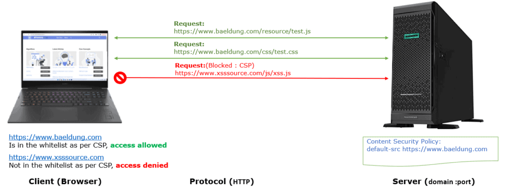

As we see, CSP allows a web page to load only whitelisted resources, whereas others are blocked. Additionally, it helps to avoid attacks like Cross Site Scripting (XSS) and other code injection attacks.

Web applications employ CORS and CSP to regulate data sharing. Moreover, CORS and CSP facilitate data loading on web pages of the same or different origin. 

The difference between them is that CSP is selective about what we can allow in our HTTP response to trust a website’s sources.

only networked entities in the same local network (or group) know the MAC address of a particular device.

In such a way, a message must arrive at the destination’s network using IP. Then, it is addressed and forwarded to the final destination using MAC. Summarily, the destination MAC changes each hop in a router or computer a message does, but the destination IP never changes along the transmission.

Let’s consider a scenario in which a computer (#01) aims to communicate with another one (#02). These machines are in different networks, as shown in the following figure:

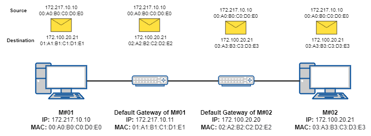


Thus, as the first machine does not know the MAC address of the second machine, it sets up the second machine’s IP address and sends the message to its default gateway, which will try to reach the proper network to forward the message.


freestar
The default gateway of the first machine does not know the MAC address of the second machine. However, they know how to reach a gateway of the destination network. So, it changes the destination MAC address to the destination network’s gateway one and forwards the message.

The gateway of the destination network receives the message. It knows the MAC address related to the destination IP address, setting it up in the MAC destination field and forwarding the message to the proper network device of the second machine


A gateway is simply a device that we place at the entrance to a network. It receives all the incoming traffic from the outside networks and sends outgoing traffic from the networking components of a network.


drwxr-xr-x

d means directory, -bmeans it is a file
read-r, w-write, x-execute
rwx-user who owns the file
r-x- group
r-x- anyone else

`chmod 644 filename`

r=read=4, w=write=2, x=execute =1

644 means 6 for the user, 4 for group and 4 for others

execute for folders mean i can `cd` into it
read means i can `ls`
w means i can add to it


With Classless Inter-Domain Routing (CIDR), your organization has more flexibility in assigning IP addresses and routing data between devices.

- Reduce IP address wastage
CIDR provides flexibility when you determine the network and host identifier assignments on an IP address. You can use CIDR to provision the required number of IP addresses for a particular network and reduce wastage. Besides, CIDR reduces routing table entries and simplifies data packet routing. 

- Transmit data quickly
CIDR allows routers to organize IP addresses into multiple subnets more efficiently. A subnet is a smaller network that exists within a network. For example, all devices connected to a router are on the same subnet and have the same IP address prefix.

- How does CIDR work?
Classless Inter-Domain Routing (CIDR) allows network routers to route data packets to the respective device based on the indicated subnet. Instead of classifying the IP address based on classes, routers retrieve the network and host address as specified by the CIDR suffix.

It’s important to understand CIDR blocks and CIDR notation to learn how CIDR works.

 Since 172.31.1.0/24 is a subset of 172.31.0.0/16, any rules in iptables applying to 172.31.0.0/16 will automatically apply to 172.31.1.0/24 as well.

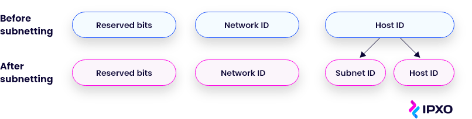
### Router
Bridging  is a feature that lets two wireless routers work together to expand the range of a wireless network
bridging more or WDS or repeater function


### Supernetting

Supernets or supernetworks are formed by aggregating several IP subnets with contiguous (i.e., adjacent or adjoining) address ranges into one large network with a single Classless Inter-Domain Routing (CIDR) prefix. This new, shorter prefix represents the supernet and its associated subnets as one entry in the routing table entries.

For example, consider four subnets:

- 10.12.1.0 /24
- 10.12.2.0 /24
- 10.12.3.0 /24
- 10.12.4.0 /24

To create a supernet for these subnets with contiguous IP prefixes, the network admins can use the prefix 10.12.0.0 /21, which covers all these subnets. Note that the routing prefix of the supernet is the same as the collection of routing prefixes of its associated subnets.


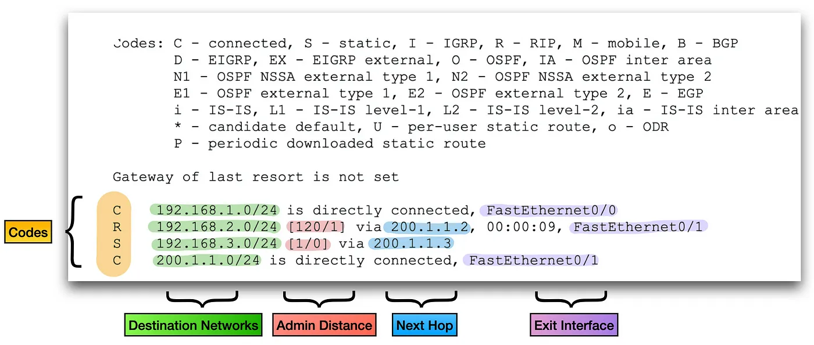

[packet-forwarding-in-routers](https://avocado89.medium.com/packet-forwarding-in-routers-40ce1948f09a)

[network-routing](https://avocado89.medium.com/network-routing-827613e5b317)
[network-routing](https://avocado89.medium.com/network-routing-d05e710ddf11)
[network-routing](https://avocado89.medium.com/network-routing-8241af62f9e9)
[network-routing](https://avocado89.medium.com/network-routing-93ec190276f7)
[network-routing](https://avocado89.medium.com/network-routing-2a1e2d1ed25)
[network-routing](https://avocado89.medium.com/network-routing-68041a56174b)
[DHCP Packet Analysis](https://avocado89.medium.com/dhcp-packet-analysis-c84827e162f0)
[Configuring DHCP server on Cisco Router](https://avocado89.medium.com/configuring-dhcp-server-on-cisco-router-part-3-3166e4d2f356)
[getting-dynamic-ip-with-dhcp](https://avocado89.medium.com/getting-dynamic-ip-with-dhcp-ee1ee1e722b0)


```java
   /**
     * A {@code KeyStore} entry that holds a {@code PrivateKey}
     * and corresponding certificate chain.
     *
     * @since 1.5
     */
    public static final class PrivateKeyEntry implements Entry {
   private final PrivateKey privKey;
        private final Certificate[] chain;
        private final Set<Attribute> attributes;

         public PrivateKeyEntry(PrivateKey privateKey, Certificate[] chain) {
            this(privateKey, chain, Collections.<Attribute>emptySet());
        }

        /**
         * Gets the end entity {@code Certificate}
         * from the certificate chain in this entry.
         *
         * @return the end entity {@code Certificate} (at index 0)
         *      from the certificate chain in this entry.
         *      If the certificate is of type X.509,
         *      the runtime type of the returned certificate is
         *      {@code X509Certificate}.
         */
        public Certificate getCertificate() {
            return chain[0];
        }
    }

     /**
     * A {@code KeyStore} entry that holds a {@code SecretKey}.
     *
     * @since 1.5
     */
    public static final class SecretKeyEntry implements Entry {

        private final SecretKey sKey;
        private final Set<Attribute> attributes;
    }

 /**
     * A {@code KeyStore} entry that holds a trusted
     * {@code Certificate}.
     *
     * @since 1.5
     */
    public static final class TrustedCertificateEntry implements Entry {

               private final Certificate cert;
        private final Set<Attribute> attributes;

        /**
         * Constructs a {@code TrustedCertificateEntry} with a
         * trusted {@code Certificate}.
         *
         * @param trustedCert the trusted {@code Certificate}
         *
         * @throws    NullPointerException if
         *      {@code trustedCert} is {@code null}
         */
        public TrustedCertificateEntry(Certificate trustedCert) {
            if (trustedCert == null) {
                throw new NullPointerException("invalid null input");
            }
            this.cert = trustedCert;
            this.attributes = Collections.<Attribute>emptySet();
        }
    }

```

KeyUsage [
  Key_CertSign
  Crl_Sign
]

Three authentication methods for ssh
- Password
- Public/Private key
- Host based


SMTP uses DNS to convert domain names into associated servers and IP addresses
SMTP servers have specific addresses to communicate with other servers and mail clients.Most server addresses are formated as smtm.exampledomain.com or smtp.mail.exampledomain.com
Gmail - smtp.gmail.com
Yahoo- smtp.mail.yahoo.com
Outlook- smtp.mail.outlook.com


## Keys

### KeyPairGenerator

The KeyPairGenerator class is used to generate pairs of
public and private keys. Key pair generators are constructed using the
getInstance factory methods (static methods that
 return instances of a given class)
 A Key pair generator for a particular algorithm creates a public/private
  key pair that can be used with this algorithm. It also associates
 algorithm-specific parameters with each of the generated keys.

 There are two ways to generate a key pair: in an algorithm-independent
  manner, and in an algorithm-specific manner.
 The only difference between the two is the initialization of the object:

 1. Algorithm-Independent Initialization
All key pair generators share the concepts of a keysize and a
 source of randomness. The keysize is interpreted differently for different
 algorithms (e.g., in the case of the `DSA` algorithm, the keysize
 corresponds to the length of the modulus).
 There is an
  `initialize`(int, java.security.SecureRandom)
 method in this KeyPairGenerator class that takes these two universally
 shared types of arguments. There is also one that takes just a
  keysize argument, and uses the  SecureRandom
 implementation of the highest-priority installed provider as the source
 of randomness. (If none of the installed providers supply an implementation
  of SecureRandom, a system-provided source of randomness is
 used.)

Since no other parameters are specified when you call the above
 algorithm-independent `initialize` methods, it is up to the
 provider what to do about the algorithm-specific parameters (if any) to be
 associated with each of the keys.
 If the algorithm is the `DSA` algorithm, and the keysize (modulus
 size) is 512, 768, 1024, or 2048, then the `Sun` provider uses a set of
 precomputed values for the `p`, `q`, and
 ` g` parameters. If the modulus size is not one of the above
 values, the `Sun` provider creates a new set of parameters. Other
  providers might have precomputed parameter sets for more than just the
 modulus sizes mentioned above. Still others might not have a list of
 precomputed parameters at all and instead always create new parameter sets.

2. Algorithm-Specific Initialization

- DiffieHellman (1024, 2048, 4096)
- DSA (1024, 2048)
- RSA (1024, 2048, 4096)

### KeyGenerator
 This class provides the functionality of a secret (symmetric) key generator. 
Key generators are constructed using one of the {@code getInstance}
 class methods of this class.
There are two ways to generate a key: in an algorithm-independent
  manner, and in an algorithm-specific manner.
  The only difference between the two is the initialization of the object:

  1. Algorithm-Independent Initialization
  2. Algorithm-Specific Initialization

- AES (128)
- DESede (168)
- HmacSHA1
- HmacSHA256


### SecretKeyFactory

This class represents a factory for secret keys.
 Key factories are used to convert keys (opaque
 cryptographic keys of type {@code Key}) into key specifications
 (transparent representations of the underlying key material), and vice
 versa.
 Secret key factories operate only on secret (symmetric) keys.
  Key factories are bi-directional, i.e., they allow to build an opaque
 key object from a given key specification (key material), or to retrieve
 the underlying key material of a key object in a suitable format.

 ### KeyFactory
 
  Key factories are used to convert keys (opaque
  cryptographic keys of type Key) into key specifications
  (transparent representations of the underlying key material), and vice
  versa.
 Key factories are bi-directional. That is, they allow you to build an
  opaque key object from a given key specification (key material), or to
  retrieve the underlying key material of a key object in a suitable format.
 
 Multiple compatible key specifications may exist for the same key.
 For example, a DSA public key may be specified using
 DSAPublicKeySpec or
  X509EncodedKeySpec. A key factory can be used to translate
  between compatible key specifications.
 
The following is an example of how to use a key factory in order to
  instantiate a DSA public key from its encoding.
  Assume Alice has received a digital signature from Bob.
 Bob also sent her his public key (in encoded format) to verify
  his signature. Alice then performs the following actions:


### KeySpec
 A (transparent) specification of the key material
 that constitutes a cryptographic key.
 
 If the key is stored on a hardware device, its
 specification may contain information that helps identify the key on the
 device.
 A key may be specified in an algorithm-specific way, or in an
  algorithm-independent encoding format (such as ASN.1).
 For example, a DSA private key may be specified by its components
  x,  p,  q, and g
  (see  DSAPrivateKeySpec), or it may be
 specified using its DER encoding
  (see PKCS8EncodedKeySpec).

- @see java.security.Key
- @see java.security.KeyFactory
- @see EncodedKeySpec
- @see X509EncodedKeySpec
- @see PKCS8EncodedKeySpec
- @see DSAPrivateKeySpec
- @see DSAPublicKeySpec


### EncodedKeySpec

```java
public abstract class EncodedKeySpec implements KeySpec {

   private byte[] encodedKey;
    private String algorithmName;
}
```


```java
public class X509EncodedKeySpec extends EncodedKeySpec {
}
```
 This class represents the ASN.1 encoding of a private key,
 encoded according to the ASN.1 type {@code PrivateKeyInfo}.


```java
public class PKCS8EncodedKeySpec extends EncodedKeySpec {
}

```
 This class represents the ASN.1 encoding of a public key,
encoded according to the ASN.1 type {@code SubjectPublicKeyInfo}
 

 ```java
public class DSAPrivateKeySpec implements KeySpec {

    private BigInteger x;
    private BigInteger p;
    private BigInteger q;
    private BigInteger g;
    }
 ```
 This class specifies a DSA private key with its associated parameters.

 ```java
public class DSAPublicKeySpec implements KeySpec {

    private BigInteger y;
    private BigInteger p;
    private BigInteger q;
    private BigInteger g;
}
 ```
 This class specifies a DSA public key with its associated parameters.


 java.security.KeyStore class represents a key store, a secure repository of cryptographic keys and/or trusted certificates (to be used, for example, during certification path validation)


To obtain the current list of protocols and cipher suites that are available by default, run the following command:

 ```bash
keytool -showinfo -tls
 ```

Sha256RSA- A SHA256 hash of this certificate was signed using RSA private key


[what-extensions-and-details-are-included-in-a-ssl-certificate](https://knowledge.digicert.com/solution/what-extensions-and-details-are-included-in-a-ssl-certificate)

[](http://www.pkiglobe.org/aki_ski.html)

There are three ways to find the issuer certificate :

- Comparing AKI in the subject certificate with the SKI in the issuer certificate. If both are equal then it means that the issuer certificate private key was used to sign the subject certificate
- Verify signature of the subject certificate using the issuer certificate public key. If signature is verified then it means that the issuer certificate private key was used to sign the subject certificate
- Name chaining i.e. compare the issuer DN in the subject certificate with the subject DN in the issuer certificate. Name chaining do not provide solid proof because there could be multiple CA certificates with the same subject DN


Subnet multiplier is the last 1 in the subnet mask

Network firewall
OSI Layers :3 &4
Protocols: TCP,UDP,DNS,FTP,SMTP,SSH and Telnet

Web Application Firewall
Layers: 7

Protection from :Ajax, Activex,Javascript,cookie manipulation,SQL injection, and URL attacks

Protocols: application protocols, http and https


reverse(ingress) proxy

API Gateway- does everything a reverse proxy can do + service discoery + circuit breaker

ingress controller- a reverse proxy in the kubernetes world

An instance of NGINX can be configured as any of the following:

A web server. This is the most common because of its performance and scalability.
A reverse proxy server. NGINX does this by directing the client’s request to the appropriate back-end server.
A load balancer. It automatically distributes your network traffic load without manual configuration.
An API gateway. This is useful for request routing, authentication, and exception handling.
A firewall for web applications. This protects your application by filtering incoming and outgoing network requests on your server.
A cache. NGINX acts as a cache to help store your data for future requests.
Protection against distributed-denial-of-service (DDoS) attacks.
K8s. These automate deployments and scaling and manage containerized applications.
A sidecar proxy. This routes traffic to and from the container it runs alongside.


Subnetting is done by hanging the default subnet mask by borrowing some of the bits of the host portion

