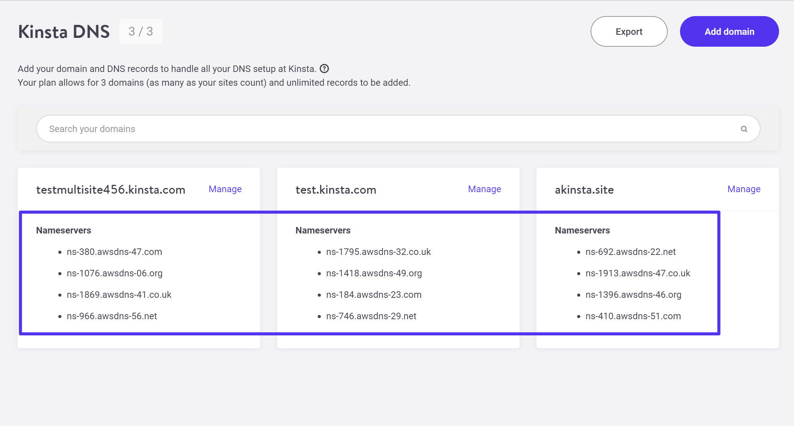
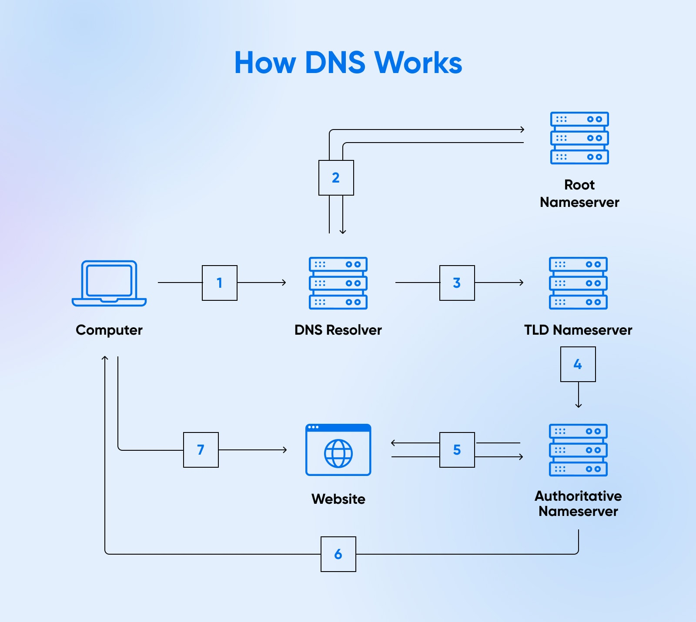

### Key Generation

The first step in preparing to run a TLS server is to generate a private key. Before you begin, you must make several decisions:

- Key algorithm
OpenSSL supports RSA, DSA, ECDSA(Elliptic Curve Digital Signature Algorithm), and EdDSA(Edwards-curve Digital Signature Algorithm) key algorithms, but not all of them are useful in practice. For example, DSA is obsolete and EdDSA is not yet widely supported. That leaves us with RSA and ECDSA algorithms to use in our certificates

- Key size
The default key sizes might not be secure, which is why you should always explicitly configure key size. For example, the default for RSA keys used to be 512 bits, which is insecure. If you used a 512-bit key on your server today, an intruder could take your certificate and use brute force to recover your private key, after which she could impersonate your web site. Today, 2,048-bit RSA keys are considered secure, or 256 bits for ECDSA.

- Passphrase
Using a passphrase with a key is optional, but strongly recommended. Protected keys can be safely stored, transported, and backed up. On the other hand, such keys are inconvenient, because they can’t be used without their passphrases. For example, you might be asked to enter the passphrase every time you wish to restart your web server. For most, this is either too inconvenient or has unacceptable availability implications. In addition, using protected keys in production does not actually increase the security much, if at all. This is because, once activated, private keys are kept unprotected in program memory; an attacker who can get to the server can get the keys from there with just a little more effort. Thus, passphrases should be viewed only as a mechanism for protecting private keys when they are not installed on production systems. In other words, it’s all right to keep passphrases on production systems, next to the keys. If you need better security in production, you should invest in a hardware solution.

To generate an RSA key, use the following `genpkey` command:
```bash
openssl genpkey -out fd.key -algorithm RSA -pkeyopt rsa_keygen_bits:2048 -aes-128-cbc

```
I specified that the key be protected with AES-128. You can also use AES-256 (with the -aes-256-cbc switch), but it’s best to stay away from the other algorithms (e.g., DES, 3DES, and SEED)

pkeyopt val->Set the public key algorithm option as opt:value

```bash
 -out outfile        Output (private key) file
 -outpubkey outfile  Output public key file
 -outform PEM|DER    output format (DER or PEM)
  -engine val         Use engine, possibly a hardware device
 -paramfile infile   Parameters file
 -algorithm val      The public key algorithm
 ```


```bash
 openssl pkey -in fd.key -pubout -out fd-public.key
```
to get the public key

```bash
openssl genpkey -out fd.key \
-algorithm EC  \
-pkeyopt ec_paramgen_curve:P-256 \
-aes-128-cbc
```
OpenSSL supports many named curves, but for web server keys, you’re generally (still) limited to only two curves that are widely supported: P-256 (also known as secp256r1 or prime256v1) and P-384 (secp384r1). Of these two, P-256 is sufficiently secure and provides better performance. If you’re curious to see a list of all named curves supported by OpenSSL, you can get it using the ecparam command and the -list_curves switch


A small number of organizations will have very strict security requirements that require the private keys to be protected at any cost. For them, the solution is to invest in a Hardware Security Module (HSM), which is a type of product specifically designed to make key extraction impossible, even with physical access to the server. To make this work, HSMs not only generate and store keys, but also perform all necessary operations (e.g., signature generation). HSMs are typically very expensive


### Creating Certificate Signing Requests
Once you have a private key, you can proceed to create a Certificate Signing Request (CSR). This is a formal request asking a CA to sign a certificate, and it contains the public key of the entity requesting the certificate and some information about the entity. This data will all be part of the certificate. A CSR is always signed with the private key corresponding to the public key it carries

```bash
openssl req -new -key fd.key -out fd.csr
```
it’s a good idea to double-check that the CSR is correct
```bash
openssl req -text -in fd.csr -noout
```
After a CSR is generated, use it to sign your own certificate and/or send it to a public CA and ask it to sign the certificate.


### Creating CSRs from Existing Certificates

You can save yourself some typing if you’re renewing a certificate and don’t want to make any changes to the information presented in it. With the following command, you can create a brand-new CSR from an existing certificate:

```bash
openssl x509 -x509toreq -in fd.crt -out fd.csr -signkey fd.key
```


### Signing Your Own Certificates
If you already have a CSR, create a certificate using the following command:

```bash
openssl x509 -req -days 365 -in fd.csr -signkey fd.key -out fd.crt
```

You don’t actually have to create a CSR in a separate step. The following command creates a self-signed certificate starting with a key alone:

```bash
openssl req -new -x509 -days 365 -key fd.key -out fd.crt
```

If you don’t wish to be asked any questions, use the -subj switch to provide the certificate subject information on the command line:
```bash
openssl req -new -x509 -days 365 -key fd.key -out fd.crt \
 -subj "/C=GB/L=London/O=Feisty Duck Ltd/CN=www.feistyduck.com"
 ```

 ### Creating Certificates Valid for Multiple Hostnames

 By default, certificates produced by OpenSSL have only one common name and are valid for only one hostname. Because of this, even if you have related web sites, you are forced to use a separate certificate for each site. In this situation, using a single multidomain certificate makes much more sense. Further, even when you’re running a single web site, you need to ensure that the certificate is valid for all possible paths that end users can take to reach it. In practice, this means using at least two names, one with the www prefix and one without (e.g., www.feistyduck.com and feistyduck.com).

 There are two mechanisms for supporting multiple hostnames in a certificate. The first is to list all desired hostnames using an X.509 extension called Subject Alternative Name (SAN). The second is to use wildcards. You can also use a combination of the two approaches when it’s more convenient. In practice, for most sites, you can specify a bare domain name and a wildcard to cover all the subdomains (e.g., `feistyduck.com` and `*.feistyduck.com`).

### Warning
When a certificate contains alternative names, all common names are ignored. Newer certificates produced by CAs may not even include any common names. For that reason, include all desired hostnames on the alternative names list.

First, place the extension information in a separate text file. I’m going to call it `fd.ext`. In the file, specify the name of the extension (`subjectAltName`) and list the desired hostnames, as in the following example:

```bash
subjectAltName = DNS:*.feistyduck.com, DNS:feistyduck.com
```

Then, when using the x509 command to issue a certificate, refer to the file using the `-extfile` switch:

```bash
openssl x509 -req -days 365 \
-in fd.csr -signkey fd.key -out fd.crt \
-extfile fd.ext
```


The rest of the process is no different from before. But when you examine the generated certificate afterward, you’ll find that it contains the SAN extension:
```bash
X509v3 extensions:
    X509v3 Subject Alternative Name: 
        DNS:*.feistyduck.com, DNS:feistyduck.com

```

###  Examining Certificates

The x509 command does just that, so let’s use it to look at the self-signed certificates you generated.

In the following example, I use the -text switch to print certificate contents and -noout to reduce clutter by not printing the encoded certificate itself (which is the default behavior):

```bash
openssl x509 -text -in fd.crt -noout

```

### Examining Public Certificates

The Basic Constraints extension is used to mark certificates as belonging to a CA, giving them the ability to sign other certificates. Non-CA certificates will either have this extension omitted or will have the value of CA set to FALSE. This extension is critical, which means that all software-consuming certificates must understand its meaning.

```bash
X509v3 Basic Constraints: critical
    CA:FALSE
```
The Key Usage (KU) and Extended Key Usage (EKU) extensions restrict what a certificate can be used for. If these extensions are present, then only the listed uses are allowed. If the extensions are not present, there are no use restrictions. What you see in this example is typical for a web server certificate, which, for example, does not allow for code signing:
```bash
X509v3 Key Usage: critical
    Digital Signature, Key Encipherment
X509v3 Extended Key Usage:
    TLS Web Server Authentication, TLS Web Client Authentication
```    
The Subject Key Identifier and Authority Key Identifier extensions establish unique subject and authority key identifiers, respectively. The value specified in the Authority Key Identifier extension of a certificate must match the value specified in the Subject Key Identifier extension in the issuing certificate. This information is very useful during the certification path-building process, in which a client is trying to find all possible paths from a leaf (server) certificate to a trusted root. Certification authorities will often use one private key with more than one certificate, and this field allows software to reliably identify which certificate can be matched to which key. In the real world, many certificate chains supplied by servers are invalid, but that fact often goes unnoticed because browsers are able to find alternative trust paths.
```bash
X509v3 Subject Key Identifier: 
    A1:EC:11:C6:E1:E8:F7:E6:98:85:FA:9A:53:F8:B8:F1:D6:88:F9:A3
X509v3 Authority Key Identifier: 
    keyid:A8:4A:6A:63:04:7D:DD:BA:E6:D1:39:B7:A6:45:65:EF:F3:A8:EC:A1
```    
The Subject Alternative Name extension is used to list all the hostnames for which the certificate is valid. This extension used to be optional; if it isn’t present, clients fall back to using the information provided in the common name (CN), which is part of the Subject field. If the extension is present, then the content of the CN field is ignored during validation.
```bash
X509v3 Subject Alternative Name:
    DNS:www.feistyduck.com, DNS:feistyduck.com
```

### Key and Certificate Conversion
Private keys and certificates can be stored in a variety of formats, which means that you’ll often need to convert them from one format to another. The most common formats are:

- #### Binary (DER) certificate
Contains an X.509 certificate in its raw form, using DER ASN.1 encoding.

- #### ASCII (PEM) certificate(s)
Contains a base64-encoded DER certificate, with -----BEGIN CERTIFICATE----- used as the header and -----END CERTIFICATE----- as the footer. Usually seen with only one certificate per file, although some programs allow more than one certificate depending on the context. For example, older Apache web server versions require the server certificate to be alone in one file, with all intermediate certificates together in another.

- #### Legacy OpenSSL key format
Contains a private key in its raw form, using DER ASN.1 encoding. Historically, OpenSSL used a format based on PKCS #1. These days, if you use the proper commands (i.e., genpkey), OpenSSL defaults to PKCS #8.

- #### ASCII (PEM) key
Contains a base64-encoded DER key, sometimes with additional metadata (e.g., the algorithm used for password protection). The text in the header and footer can differ, depending on what underlying key format is used.

- #### PKCS #7 certificate(s)
A complex format designed for the transport of signed or encrypted data, defined in RFC 2315. It’s usually seen with .p7b and .p7c extensions and can include the entire certificate chain as needed. This format is supported by Java’s keytool utility.

- #### PKCS #8 key
The new default format for the private key store. PKCS #8 is defined in RFC 5208. Should you need to convert from PKCS #8 to the legacy format for whatever reason, use the pkcs8 command.

- #### PKCS #12 (PFX) key and certificate(s)
A complex format that can store and protect a server key along with an entire certificate chain. It’s commonly seen with .p12 and .pfx extensions. This format is commonly used in Microsoft products, but is also used for client certificates. These days, the PFX name is used as a synonym for PKCS #12, even though PFX referred to a different format a long time ago (an early version of PKCS #12). It’s unlikely that you’ll encounter the old version anywhere.


### PEM and DER Conversion

Certificate conversion between PEM and DER formats is performed with the x509 tool. To convert a certificate from PEM to DER format:
```bash
openssl x509 -inform PEM -in fd.pem -outform DER -out fd.der
```
To convert a certificate from DER to PEM format:
```bash
openssl x509 -inform DER -in fd.der -outform PEM -out fd.pem
```
The syntax is identical if you need to convert private keys between DER and PEM formats, but different commands are used: `rsa` for RSA keys, and `dsa` for DSA keys


### PKCS #12 (PFX) Conversion
One command is all that’s needed to convert the key and certificates in PEM format to PKCS #12. The following example converts a key (`fd.key`), certificate (`fd.crt`), and intermediate certificates (`fd-chain.crt`) into an equivalent single PKCS #12 file:

```bash
openssl pkcs12 -export \
    -name "My Certificate" \
    -out fd.p12 \
    -inkey fd.key \
    -in fd.crt \
    -certfile fd-chain.crt

 ```   


`TLS_AES_256_GCM_SHA384 TLSv1.3 Kx=any Au=any Enc=AESGCM(256) Mac=AEAD`

Each line of output provides extended information on one suite. From left to right:

1. Suite name

2. Required minimum protocol version1

3. Key exchange algorithm

4. Authentication algorithm

5. Encryption algorithm and strength

6. MAC (integrity) algorithm


RSA is most commonly used at 2,048 bits. In my results, one CPU of the tested server can perform about 1,000 sign (server) operations and 22,000 verify (client) operations every second. As for ECDSA, it’s typically only used at 256 bits. We can see that at this length, ECDSA can do 10 times as many signatures. On the other hand, it’s slower when it comes to the verifications, at barely 6,500 operations per second:
```bash
                             sign      verify   sign/s   verify/s
 256 bits ecdsa (nistp256)   0.0000s   0.0002s  20508.1  6566.2
 384 bits ecdsa (nistp384)   0.0017s   0.0013s    580.4   755.0
 521 bits ecdsa (nistp521)   0.0006s   0.0012s   1711.5   840.8

 ```
In practice, you care more about the sign operations because servers are designed to provide services to a great many clients. The clients, on the other hand, are typically communicating with only a small number of servers at the same time. The fact that ECDSA is slower in this scenario doesn’t matter much.


As a bonus, the subordinate CA will be technically constrained, which means that it will be allowed to issue certificates only for the allowed hostnames.

### Root CA Configuration
Before we can actually create a CA, we need to prepare a configuration file (root-ca.conf) that will tell OpenSSL exactly how we want things set up. Configuration files aren’t needed most of the time, during normal usage, but they are essential when it comes to complex operations, such as root CA creation. OpenSSL configuration files are powerful; 

```bash
[default]
name                    = root-ca
domain_suffix           = example.com
aia_url                 = http://$name.$domain_suffix/$name.crt
crl_url                 = http://$name.$domain_suffix/$name.crl
ocsp_url                = http://ocsp.$name.$domain_suffix:9080
default_ca              = ca_default
name_opt                = utf8,esc_ctrl,multiline,lname,align

[ca_dn]
countryName             = "GB"
organizationName        = "Example"
commonName              = "Root CA"

```
Because this root CA is going to be used only for the issuance of subordinate CAs, I chose to have the certificates valid for 10 years. For the signature algorithm, the secure SHA256 is used by default.


```bash
Using a CA signed certificate
------------------------------

# Generate a Private with a self-signed certificate for code signing
keytool -genkey -alias code_signing -keyalg RSA -keysize 2048 -sigalg sha256WithRSA -validity 730 -keystore myStore.p12 -storetype pkcs12 -storepass env:kpwd -dname "CN=CodeSigning" -ext KU="digitalSignature" -ext EKU="codeSigning"


# List contents of my newly created keystore. 
keytool -list -keystore myStore.p12 -storetype pkcs12 -storepass env:kpwd -v


# Generate a certificate request.
keytool -certreq -keystore myStore.p12 -storetype pkcs12 -storepass env:kpwd -alias code_signing -sigalg sha256WithRSA -file codesigning.csr


# bring the csr I generated on the machine with has an OpenSSL based CA
scp spaul@akaza:keyStores/code_signing.csr .


# Now I'll sign this csr using OpenSSL. 
openssl ca -config myCA/myIssuing/myIssuing.cnf -extensions code_signing -days 730 -notext -md sha256 -in code_signing.csr -out code_signing.cer


# I'll pass the signed certificate back to the machine which has my keystore.
scp code_signing.cer spaul@akaza:keyStores/


# Command to generate a p7b file.
openssl crl2pkcs7 -nocrl -certfile myRoot.cer -certfile myIssuing.cer -certfile code_signing.cer -out code_signing.p7b


# Import p7b file to my keystore.
keytool -importcert -keystore myStore.p12 -storetype pkcs12 -storepass env:kpwd -alias code_signing -file code_signing.p7b


# Second method is to import root certificate followed by issuing and issued certificate
keytool -importcert -alias myIssuing -keystore myStore.p12 -storetype pkcs12 -storepass env:kpwd -file myIssuing.cer
keytool -importcert -alias myRoot -keystore myStore.p12 -storetype pkcs12 -storepass env:kpwd -file myRoot.cer
keytool -importcert -keystore myStore.p12 -storetype pkcs12 -storepass env:kpwd -alias code_signing -file code_signing.cer
 
 

# Third method is the add root certificate and issuing certificate into cacerts (TrustStore of Java) and then import the signed certificate into keystore.
sudo keytool -importcert -alias myRoot -keystore /opt/java/jdk1.8.0_333/jre/lib/security/cacerts -file myRoot.cer
sudo keytool -importcert -alias myIssuing -keystore /opt/java/jdk1.8.0_333/jre/lib/security/cacerts -file myIssuing.cer
keytool -importcert -keystore myStore.p12 -storetype pkcs12 -storepass env:kpwd -alias code_signing -file code_signing.cer -trustcacerts


Generating Certificates using Keytool
----------------------------------------

keytool -genkey -alias testSigningKey -keyalg RSA -keysize 2048 -keystore myStore.p12 -storetype PKCS12 -validity 730 -sigalg sha256WithRSA -dname "CN=Testing" -storepass env:KPWD

keytool -list -keystore myStore.p12 -storetype pkcs12 -storepass env:KPWD -v


Setting KeyUsage
-------------------

Critical KeyUsage
> keytool -genkey -alias testSigningKey -keyalg RSA -keysize 2048 -sigalg sha256WithRSA -validity 730 -keystore myStore.p12 -storetype PKCS12 -storepass env:KPWD -dname "CN=Testing" -ext KU:C="digitalSignature"

Multiple KeyUsage
> keytool -genkey -alias testSigningKey -keyalg RSA -keysize 2048 -sigalg sha256WithRSA -validity 730 -keystore myStore.p12 -storetype PKCS12 -storepass env:KPWD -dname "CN=Testing" -ext KU:C="digitalSignature,dataEncipherment"

Setting Non-Critical KeyUsage
> keytool -genkey -alias testSigningKey -keyalg RSA -keysize 2048 -sigalg sha256WithRSA -validity 730 -keystore myStore.p12 -storetype PKCS12 -storepass env:KPWD -dname "CN=Testing" -ext KU="digitalSignature,dataEncipherment"

Using short forms for Key Usage
> keytool -genkey -alias testSigningKey -keyalg RSA -keysize 2048 -sigalg sha256WithRSA -validity 730 -keystore myStore.p12 -storetype PKCS12 -storepass env:KPWD -dname "CN=Testing" -ext KU="dS,dataE"

> keytool -genkey -alias testSigningKey -keyalg RSA -keysize 2048 -sigalg sha256WithRSA -validity 730 -keystore myStore.p12 -storetype PKCS12 -storepass env:KPWD -dname "CN=Testing,O=Acme Inc.,OU=PKI" -ext KU:critical="dS,crlS,encipherO,decipherO,kA,keyCertS,nR"


Setting Extended KeyUsage
--------------------------
keytool -genkey -alias testSigningKey -keyalg RSA -keysize 2048 -sigalg sha256WithRSA -validity 730 -keystore myStore.p12 -storetype PKCS12 -storepass env:KPWD -dname "CN=Testing,O=Acme Inc.,OU=PKI" -ext KU:critical="dS,nR" -ext EKU:C="codeSigning"

keytool -genkey -alias testSigningKey -keyalg RSA -keysize 2048 -sigalg sha256WithRSA -validity 730 -keystore myStore.p12 -storetype PKCS12 -storepass env:KPWD -dname "CN=Testing,O=Acme Inc.,OU=PKI" -ext KU:critical="digitalSignature,keyCertSign,crlSign," -ext EKU="serverAuth,clientAuth"


Setting Basic Constraints
---------------------------

keytool -genkey -alias testSigningKey -keyalg RSA -keysize 2048 -sigalg sha256WithRSA -validity 730 -keystore myStore.p12 -storetype PKCS12 -storepass env:KPWD -dname "CN=Testing,O=Acme Inc.,OU=PKI" -ext KU:critical="digitalSignature,keyCertSign,crlSign," -ext EKU="serverAuth,clientAuth" -ext BC="ca:true,pathlen:0"

keytool -genkey -alias testSigningKey -keyalg RSA -keysize 2048 -sigalg sha256WithRSA -validity 730 -keystore myStore.p12 -storetype PKCS12 -storepass env:KPWD -dname "CN=Testing,O=Acme Inc.,OU=PKI" -ext KU:critical="dS,nR" -ext EKU:C="codeSigning" -ext BC="ca:false,pathlen:0"


Setting Subject Alternate Names
---------------------------------

keytool -genkey -alias testSigningKey -keyalg RSA -keysize 2048 -sigalg sha256WithRSA -validity 730 -keystore myStore.p12 -storetype PKCS12 -storepass env:KPWD -dname "CN=Testing,O=Acme Inc.,OU=PKI" -ext SAN="DNS:cyberhashira.com"

keytool -genkey -alias testSigningKey -keyalg RSA -keysize 2048 -sigalg sha256WithRSA -validity 730 -keystore myStore.p12 -storetype PKCS12 -storepass env:KPWD -dname "CN=Testing,O=Acme Inc.,OU=PKI" -ext SAN="DNS:cyberhashira.com,IP:127.0.0.1"

keytool -genkey -alias testSigningKey -keyalg RSA -keysize 2048 -sigalg sha256WithRSA -validity 730 -keystore myStore.p12 -storetype PKCS12 -storepass env:KPWD -dname "CN=Testing,O=Acme Inc.,OU=PKI" -ext SAN="DNS:cyberhashira.com,IP:127.0.0.1,EMAIL:web-admin@cyberhashira.com"


Setting CDP
------------

Single CDP 
> keytool -genkey -alias testSigningKey -keyalg RSA -keysize 2048 -sigalg sha256WithRSA -validity 730 -keystore myStore.p12 -storetype PKCS12 -storepass env:KPWD -dname "CN=Testing,O=Acme Inc.,OU=PKI" -ext crl="uri:http://127.0.0.1/test.crl"

Multiple CDP
> keytool -genkey -alias testSigningKey -keyalg RSA -keysize 2048 -sigalg sha256WithRSA -validity 730 -keystore myStore.p12 -storetype PKCS12 -storepass env:KPWD -dname "CN=Testing,O=Acme Inc.,OU=PKI" -ext crl="uri:http://127.0.0.1/test.crl,uri:ftp://127.0.0.1/test.crl,uri:ldap://127.0.0.1/test.crl"


Setting Authority Information Access
--------------------------------------

Setting issuer cert path
> keytool -genkey -alias testSigningKey -keyalg RSA -keysize 2048 -sigalg sha256WithRSA -validity 730 -keystore myStore.p12 -storetype PKCS12 -storepass env:KPWD -dname "CN=Testing,O=Acme Inc.,OU=PKI" -ext AIA="caIssuers:uri:http://cyberhashira.com/issuer.cer"


Setting OCSP path
> keytool -genkey -alias testSigningKey -keyalg RSA -keysize 2048 -sigalg sha256WithRSA -validity 730 -keystore myStore.p12 -storetype PKCS12 -storepass env:KPWD -dname "CN=Testing,O=Acme Inc.,OU=PKI" -ext KU:critical="dS,nR" -ext EKU:C="codeSigning" -ext BC="ca:false,pathlen:0" -ext SAN="DNS:cyberhashira.com,IP:127.0.0.1,EMAIL:web-admin@cyberhashira.com" -ext crl="uri:http://127.0.0.1/test.crl,uri:ftp://127.0.0.1/test.crl,uri:ldap://127.0.0.1/test.crl" -ext AIA="caIssuers:uri:http://cyberhashira.com/issuer.cer,ocsp:uri:http://ocsp.cyberhashira.com"

```


[private-ca-creating-root](https://www.feistyduck.com/library/openssl-cookbook/online/openssl-command-line/private-ca-creating-root.html)

[private-ca-create-subordinate](https://www.feistyduck.com/library/openssl-cookbook/online/openssl-command-line/private-ca-create-subordinate.html)


[openssl-cookbook](https://www.feistyduck.com/library/openssl-cookbook/online/)


Keystore-stores keys and certificates
TrustStore-stores only certificates




A nameserver connects your domain name with the server’s Internet Protocol (IP) address that hosts your website



A Record
The address record is the most basic type of DNS record. It points a domain (or subdomain) to an IP address.

CNAME Record
The canonical name record points a domain to another domain instead of an IP address. This is used when a site has subdomains, such as shop.myblog.com or donations.example.myblog.com.

These are subdomains of myblog.com. Let’s say that each of these subdomains has a CNAME record containing the value myblog.com. Since the DNS is looking for an IP address when the CNAME record is accessed, a further lookup is carried out at myblog.com (as this is the value contained in the CNAME file).

It’ll then return the IP address stored in myblog.com’s “A” record. This means that these subdomains are aliases of the main domain, and the canonical name (or “true name”) of these subdomains is actually myblog.com.

MX Record
A mail exchange record is used to direct emails to an address registered on your domain (e.g., hello@myblog.com) per the Simple Mail Transfer Protocol (SMTP) — the standard protocol for email.

Ensuring that your MX records point to the right mail server is important. Otherwise, you won’t receive emails through your account. Also, before switching hosts, we recommend backing up your emails.

NS Record
As mentioned previously, this is the nameserver record. You can use this setting to change your nameservers so that they point to your new hosting provider.

What Is The Difference Between DNS Resolver And Nameserver?
A DNS resolver is a piece of software that initiates DNS queries whenever you try to access a website or internet resource by domain name. The resolver contacts nameservers and asks “What is the IP address for this domain name?”

The nameserver is the dedicated server computer that has the DNS records stored and which looks up the right IP address to send back to the resolver.


A TLD nameserver maintains information for all the domain names that share a common domain extension, such as .com, .net, or whatever comes after the last dot in a URL. For example, a .com TLD nameserver contains information for every website that ends in ‘.com’. If a user was searching for google.com, after receiving a response from a root nameserver, the recursive resolver would then send a query to a .com TLD nameserver, which would respond by pointing to the authoritative nameserver (see below) for that domain.

When a recursive resolver receives a response from a TLD nameserver, that response will direct the resolver to an authoritative nameserver. The authoritative nameserver is usually the resolver’s last step in the journey for an IP address. The authoritative nameserver contains information specific to the domain name it serves (e.g. google.com) and it can provide a recursive resolver with the IP address of that server found in the DNS A record, or if the domain has a CNAME record (alias) it will provide the recursive resolver with an alias domain, at which point the recursive resolver will have to perform a whole new DNS lookup to procure a record from an authoritative nameserver (often an A record containing an IP address). Cloudflare DNS distributes authoritative nameservers, which come with Anycast routing to make them more reliable.


[what-is-pkcs](https://www.spiceworks.com/it-security/network-security/articles/what-is-pkcs/)


[](https://nginx.org/en/docs/beginners_guide.html)
[](https://nginx.org/en/docs/)
Alternatives to X509 certificates-Simple Public Key Infrastructure(SPKI) certificates
Pretty Good Privacy(PGP) certificate


`openssl genrsa --aes256 -out ca.key.pem 4096`
the private key is encripted with aes

In the AES algorithm, we need three parameters: input data, secret key, and IV. IV is not used in ECB mode.

- Input Data
The input data to the AES can be string, file, object, and password-based.
- Secret Key
There are two ways for generating a secret key in the AES: generating from a random number, or deriving from a given password.

In the first approach, the secret key should be generated from a Cryptographically Secure (Pseudo-)Random Number Generator like the SecureRandom class.

For generating a secret key, we can use the KeyGenerator class. Let’s define a method for generating the AES key with the size of n (128, 192, and 256) bits:
```java
public static SecretKey generateKey(int n) throws NoSuchAlgorithmException {
    KeyGenerator keyGenerator = KeyGenerator.getInstance("AES");
    keyGenerator.init(n);
    SecretKey key = keyGenerator.generateKey();
    return key;
}
```

In the second approach, the AES secret key can be derived from a given password using a password-based key derivation function like PBKDF2. We also need a salt value for turning a password into a secret key. The salt is also a random value.

We can use the SecretKeyFactory class with the `PBKDF2WithHmacSHA256` algorithm for generating a key from a given password.

Let’s define a method for generating the AES key from a given password with 65,536 iterations and a key length of 256 bits:

```java
public static SecretKey getKeyFromPassword(String password, String salt)
    throws NoSuchAlgorithmException, InvalidKeySpecException {
    
    SecretKeyFactory factory = SecretKeyFactory.getInstance("PBKDF2WithHmacSHA256");
    KeySpec spec = new PBEKeySpec(password.toCharArray(), salt.getBytes(), 65536, 256);
    SecretKey secret = new SecretKeySpec(factory.generateSecret(spec)
        .getEncoded(), "AES");
    return secret;
}
```
We’ve wrapped all the four elements discussed above into a PBEKeySpec object. Next, using the SecretKeyFactory, we get an instance of PBKDF2WithHmacSHA256 algorithm to generate the key.

Finally, invoking generateSecret with the PBEKeySpec, we generate a SecretKey based on a human-readable password.
- Initialization Vector (IV)


`openssl -s_client -connect twitter.com:443`

store the certificate chain in a file( eg twitter.com-cert)

`openssl -x509 -in twitter.com-cert -nout -text`
We can get an interactive SSL connection to our server, using the openssl s_client command:

`openssl s_client -connect baeldung.com:443`

This keeps the interactive session open until we type Q (quit) and press <Enter>, or until EOF is encountered.

We can use the -showcerts option to get the complete certificate chain:

`openssl s_client -showcerts -connect baeldung.com:443`

keytool can create and manage keystore "key" entries that each contain a private key and an associated certificate "chain". The first certificate in the chain contains the public key corresponding to the private key.

When keys are first generated (see the -genkeypair command), the chain starts off containing a single element, a self-signed certificate. A self-signed certificate is one for which the issuer (signer) is the same as the subject (the entity whose public key is being authenticated by the certificate). Whenever the -genkeypair command is called to generate a new public/private key pair, it also wraps the public key into a self-signed certificate.

The only reason it is stored in a certificate is because this is the format understood by most tools, so the certificate in this case is only used as a "vehicle" to transport the root CA's public key

[](https://www.ibm.com/docs/en/sdk-java-technology/8?topic=certificate-chains)

The X.509 standard defines what information can go into a certificate, and describes how to write it down (the data format). All the data in a certificate is encoded using two related standards called ASN.1/DER. Abstract Syntax Notation 1 describes data. The Definite Encoding Rules describe a single way to store and transfer that data.


`X.509 is a standard defining the format of public-key certificates`. So this format describes a public key, among other information.

`DER is the most popular encoding format to store data, like X.509 certificates, and PKCS8 private keys in files`. It’s a binary encoding, and the resulting content can’t be viewed with a text editor.

`PKCS8 is a standard syntax for storing private key information`. The private key can be optionally encrypted using a symmetric algorithm. 

Not only can RSA private keys be handled by this standard, but also other algorithms. The PKCS8 private keys are typically exchanged through the PEM encoding format.

`PEM is a base-64 encoding mechanism of a DER certificate`. PEM can also encode other kinds of data, such as public/private keys and certificate requests.


when you create(generate) a keypair using keytool, the certificate is created and added to the certificate chain
you create a private key and a corresponding public key (contained in a certificate). The private key is stored securely in the keystore, while the public key is included in a certificate.

For trusted certificates (e.g., root CA certificates), you import them into the truststore rather than the keystore. The truststore contains certificates that the Java application trusts when establishing SSL/TLS connections

import the server certificate first

- TLS Web server authentication
Digital signature, key encipherment or key agreement
- TLS Web client authentication
Digital signature and/or key agreement

PKCS#7: Cryptographic Message Syntax Standard

PKCS#8: Private-Key Information Syntax Standard

PKCS#10: Certification Request Syntax Standard

PKCS#11: Cryptographic Token Interface Standard

PKCS#12: Personal Information Exchange Syntax Standard
PKCS #12 is built on PKCS #8 which only deals with private keys
`openssl crl2pkcs7 -nocrl -certfile fullchain.pem | openssl pkcs7 -print_certs -text` prints including certificate in pem format

`openssl crl2pkcs7 -nocrl -certfile fullchain.pem | openssl pkcs7 -print_certs -text -noout` just text


The Java KeyStore is a database that can contain keys.
A MAC is similar to a message digest, but uses an additional key to encrypt the message digest. Only by having both the original data and the key can you verify the MAC. Thus, a MAC is a more secure way to guard a block of data from modification than a message digest.

[java-keystore-truststore-difference](https://www.baeldung.com/java-keystore-truststore-difference)

A Java keystore stores private key entries, certificates with public keys, or just secret keys that we may use for various cryptographic purposes.
Usually, we’ll use a keystore when we’re a server and want to use HTTPS. During an SSL handshake, the server looks up the private key from the keystore, and presents its corresponding public key and certificate to the client.

PBEWithHmacSHA512AndAES_128
- hashes the password along with the salt value, to produce a derived key. The salt adds randomness to the key derivation process

“HmacSHA512” in the above PBE mode that only applies to the key derivation from the password.There is no integrity protection at the level of individual entries.

“PBEWithHmacSHA512AndAES_256” will derive a 256-bit AES key using salted PBKDF2 and then encrypt the stored key using `AES/CBC/PKCS5Padding` with that key. You can also increase the number of iterations of PBKDF2 used

[pbkdf2-iterations](https://neilmadden.blog/2023/01/09/on-pbkdf2-iterations/)

There are two related reasons for using a password-based key derivation function like PBKDF2. One is to protect password hashes used for login on a website. The other is to derive a cryptographic key from a password to use for encryption.

[](https://www.openssl.org/blog/blog/2017/05/04/tlsv1.3/index.html)

### PBKDF2
PBKDF2 is a Password-Based Key Derivation Function in which a key is generated from the Password. The generated key can be used as an encryption key or as a hash value that needs to be stored in the database.

#### Key Derivation Process
The PBKDF2 key derivation function has 5 input parameters.
`DK = PBKDF2(Password, Salt, PRF, c, dkLen)`

The output of the PBKDF2 function is the Derived Key. (In our case DK is the hashed value)

- Password:- The master password from which the derived key is generated. (In our case, this is the password that needs to be hashed)
- Salt:- Sequence of bits known as cryptographic salt.

- PRF:- Pseudo-Random Function is the basic building block of PBKDF2 in constructing the key derivation function.

PBKDF2 applies the PRF many times to the password. This means that an attacker who tries to crack the password needs to apply the function many times
- c:- The number of iterations that need to be performed.
The choice of no.of iterations can be varied according to the environmental conditions. Iteration count can be increased to increase the security
- dkLen:- Generated derived key bit length.
The derived key (hashed value) length can be specified according to the requirements.


[pbkdf2-hashing-algorithm](https://nishothan-17.medium.com/pbkdf2-hashing-algorithm-841d5cc9178d)